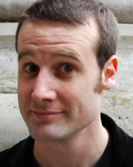
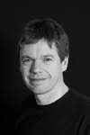

MathsJams are gatherings for like-minded mathematically inclined people with an interest in problem solving and puzzles. The monthly meetings are held in various locations, but the weekend events in previous years were such huge successes that they've become a regular fixture. The weekend consists of lightning talks, long breaks and plenty of chances to socialise and share your favourite maths.

Inspired by the [Gathering For Gardner](http://www.guardian.co.uk/science/2008/may/31/maths.science) events, MathsJam is a chance to share, discuss, solve or be confounded by a vast array of mathematical puzzles in a friendly, informal and inspirational atmosphere. We're not looking for Earth-shattering maths, nor new discoveries, nor anything exceptionally deep or meaningful. We're looking for things that are surprising, unexpected, elegant, neat, cool, or whatever just intrigues you.

**Students**: By looking at problems, puzzles, games and other challenges you can gain a wealth of techniques and materials for approaching problems, both real-world and in your studies.

**Teachers**: You'll get a vast selection of stimulating starters to stretch and challenge even the most demanding students, an awareness of how to encourage the most able students to enrich their learning of mathematics, and a variety of techniques to lead students to develop their thinking skills and to question and work with others collaboratively to solve mathematical problems.

**Professionals**: Puzzles and games form a microcosm in which we can explore problem-solving techniques and analytical styles.

**Everyone else**: It should be a fun, stimulating event that let you connect, or re-connect, with your love of maths!

Some writeups of the gathering:

[MathsJam Conference 2015](https://journals.gre.ac.uk/index.php/msor/article/view/278), by Peter Rowlett for MSOR Connections

[A Non-mathematician at the MathsJam Weekend, November 2014](http://www.solipsys.co.uk/new/ANonMathematicianAtMathsJam.html?TW_20160514), by Rachael Wright

##The Team 
 
The MathsJam team is headed by Colin Wright, with some advisers to assist.

### Colin Wright
</img>

Colin has a Ph.D. from Cambridge and has worked as a research mathematician, and done research in computing. His day job is developing systems to do the maritime version of Air Traffic Control, and in his "free time" he travels around the world giving lectures on how and why maths can be interesting, fun, useful and even on occasion, exciting.

### James Grime

James Grime has a PhD in Pure Maths from York University, where he stayed on for a time as a lecturer and researcher. James has also worked for Cambridge University and the Millennium Mathematics Project as the Enigma Project Officer. In his spare time he has many hobbies, including juggling, unicycling and other circus skills.

### Matt Parker

 
Possibly the only person to hold the prestigious title of London Mathematical Society Popular Lecturer while simultaneously having a sold-out comedy show at the Edinburgh Festival Fringe, Matt is always keen to mix his two passions of mathematics and stand-up. Originally a maths teacher from Australia, Matt now lives in London and works both as a stand-up comedian and a maths communicator. This involves spreading his love of maths via books, radio programmes, TV shows, newspapers, school visits, live comedy shows and occasionally harassing people in the street. Matt is also the Public Engagement in Mathematics Fellow at Queen Mary University of London.

[Matt's website](http://www.standupmaths.com)

### Katie Steckles

Katie Steckles is a mathematician based in Manchester, who gives talks and workshops on different areas of maths. She finished her PhD in 2011, and since then has talked about maths in schools, at science festivals, on BBC radio, at music festivals, as part of theatre shows and on the internet. She enjoys doing puzzles, solving the Rubik's cube and baking things shaped like maths.

[Katie's website](http:/www.katiesteckles.co.uk)

### Rob Eastaway

Rob Eastaway is an author who is active in the popularisation of mathematics. He has a degree in Engineering and Management Science from the University of Cambridge, and was made President of the UK Mathematical Association for 2007/2008. He is also a former puzzle-writer for the New Scientist Magazine. Rob is the director of Maths Inspiration, a national programme of maths lectures for teenagers which involves some of the UK's leading maths speakers.

[Rob's website](http://www.robeastaway.com/)

[Maths Inspiration](http://www.mathsinspiration.com)
