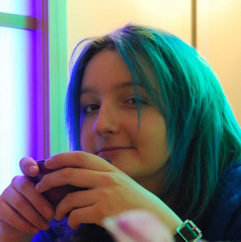

MathsJam Gathering is a fully volunteer-run event, and many people play an important role in making the event a success. The people listed on this page form the core orgnisational team and lead the organisation of the event.

### Colin Wright
</img>

Colin has a Ph.D. from Cambridge and has worked as a research mathematician, and done research in computing. His day job is developing systems to do the maritime version of Air Traffic Control, and in his "free time" he travels around the world giving lectures on how and why maths can be interesting, fun, useful and even on occasion, exciting.

### Sam Hartburn

### Sam Holloway

### Alison Kiddle

### Christian Lawson-Perfect

### Sophie Maclean

### Matt Parker

 
Possibly the only person to hold the prestigious title of London Mathematical Society Popular Lecturer while simultaneously having a sold-out comedy show at the Edinburgh Festival Fringe, Matt is always keen to mix his two passions of mathematics and stand-up. Originally a maths teacher from Australia, Matt now lives in London and works both as a stand-up comedian and a maths communicator. This involves spreading his love of maths via books, radio programmes, TV shows, newspapers, school visits, live comedy shows and occasionally harassing people in the street. Matt is also the Public Engagement in Mathematics Fellow at Queen Mary University of London.

[Matt's website](http://www.standupmaths.com)

### Matthew Scroggs

[Scroggs's website](https://mscroggs.co.uk)

### Ben Sparks

### Katie Steckles

Katie Steckles is a mathematician based in Manchester, who gives talks and workshops on different areas of maths. She finished her PhD in 2011, and since then has talked about maths in schools, at science festivals, on BBC radio, at music festivals, as part of theatre shows and on the internet. She enjoys doing puzzles, solving the Rubik's cube and baking things shaped like maths.

[Katie's website](http://www.katiesteckles.co.uk)
